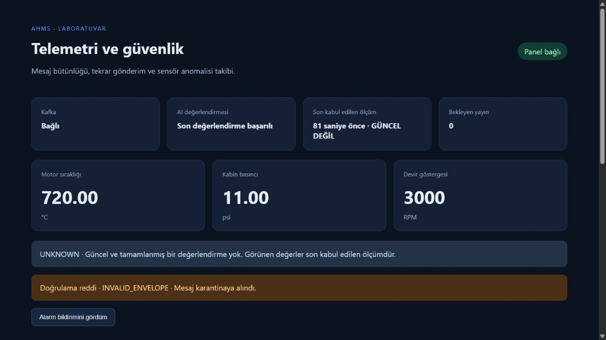
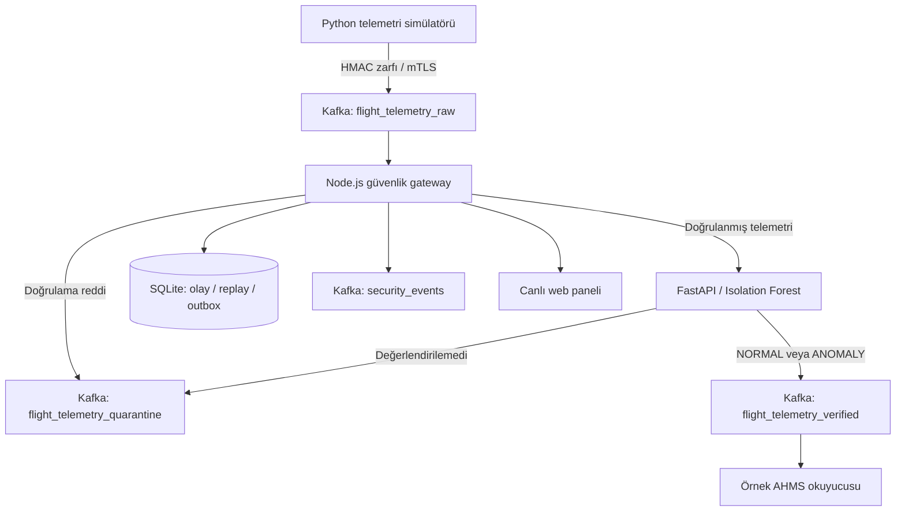

# AHMS Siber Güvenlik Laboratuvarı

Uçak Sağlık Yönetimi (AHMS) telemetrisinde mesaj bütünlüğünü, tekrar gönderimleri ve sensör anomalilerini izlemek için geliştirdiğim bir siber güvenlik projesi.

Node.js gateway, Kafka, Python/FastAPI ve Isolation Forest modeli birlikte çalışır. Kafka bağlantıları mTLS ile korunur; servisler konu bazlı erişim yetkileriyle ayrılır. Çalışma sırasında model çıkarımı yereldir, bulut bağlantısı gerektirmez.



## Mevcut özellikler

- **Mesaj doğrulama:** HMAC-SHA256, üretici–anahtar–sensör eşleştirmesi ve şema kontrolü.
- **Replay engelleme:** zaman penceresi, kalıcı sıra numarası ve mesaj kimliği kontrolü.
- **Kafka güvenliği:** zorunlu istemci sertifikası, CA/hostname doğrulaması ve kimliğe bağlı ACL.
- **Anomali değerlendirmesi:** sentetik veriyle eğitilen Isolation Forest ve ayrı demo aralığı kuralları.
- **Kalıcı olay kaydı:** SQLite üzerinde karar, replay durumu ve bekleyen yayın kuyruğu.
- **Canlı panel:** telemetri, güvenlik olayları, bağlantı durumu, veri güncelliği ve alarm bildirimi.
- **İzleme:** `/health`, `/live`, `/metrics` ve `/api/events` uç noktaları.
- **Laboratuvar senaryoları:** normal veri, anomali, mesaj değiştirme, replay ve AI kesintisi.

## Mimari



| Değerlendirme | Karar | Anlamı |
|---|---|---|
| `NORMAL` | `ACCEPT` | Doğrulama ve model değerlendirmesi tamamlandı. |
| `ANOMALY` | `ACCEPT` | Sensör anomalisi gözlem amacıyla işaretlendi. |
| `REJECTED` | `QUARANTINE` | Kimlik, bütünlük, replay veya şema kontrolü reddedildi. |
| `UNKNOWN` | `QUARANTINE` | AI değerlendirmesi tamamlanamadı. |

`ACCEPT`, uçuş açısından güvenli veya siber saldırısız olduğu anlamına gelmez. Sensör anomalileri servis ya da sensörü otomatik kapatmaz. Karantina, mesajın doğrulanmış veri akışına alınmamasıdır.

## Kurulum

Gerekenler: **Docker Desktop (Linux containers), Docker Compose ve Node.js 24**. İlk kurulum imaj ve bağımlılık indirmek için internet ister.

Projeyi klonlayıp kök klasöründe şu komutları çalıştırın:

```powershell
# Yalnızca yeni kurulumda: rastgele yerel HMAC anahtarları oluşturur.
npm run init

powershell -NoProfile -ExecutionPolicy Bypass -File .\scripts\Start-SecureLab.ps1
```

Betik TLS sertifikalarını hazırlar, servisleri başlatır, Kafka erişim testlerini çalıştırır ve telemetri simülatörünü açar. Mevcut anahtarların üzerine yazılmaz; mevcut kurulumda `npm run init` komutunu yeniden çalıştırmayın.

- Panel: **http://127.0.0.1:3000**
- AI sağlık kontrolü: **http://127.0.0.1:8000/health**
- Gateway sağlık kontrolü: **http://127.0.0.1:3000/health**

Linux/macOS için aynı işlemler:

```bash
npm run init
docker compose --profile setup build cert-init
docker compose --profile setup run --no-deps --rm cert-init
docker compose build ai gateway simulator reader security-test
docker compose up -d --wait --wait-timeout 240 zookeeper kafka ai gateway
docker compose run --no-deps --rm simulator python telemetry_producer.py --scenario normal --count 1 --interval 0
docker compose run --no-deps --rm security-test
docker compose --profile demo up --no-deps -d simulator
```

Tam offline dağıtım paketi henüz yoktur. İnternetsiz kurulum için imajların önceden oluşturulup `docker save` / `docker load` ile taşınması gerekir.

## Senaryolar

Aynı üretici kimliğiyle eşzamanlı simülatör çalıştırmak sıra numaralarının teslim sırasını etkileyebilir. Önce sürekli simülatörü durdurun:

```powershell
docker compose stop simulator
docker compose run --no-deps --rm simulator python telemetry_producer.py --scenario normal --count 1
docker compose run --no-deps --rm simulator python telemetry_producer.py --scenario anomaly --count 1
docker compose run --no-deps --rm simulator python telemetry_producer.py --scenario tamper --count 1
docker compose run --no-deps --rm simulator python telemetry_producer.py --scenario replay --count 1
```

AI kesintisini denemek için `docker compose stop ai` sonrasında normal mesaj gönderin; `UNKNOWN / AI_UNAVAILABLE` beklenir. Ardından `docker compose start ai` ve `docker compose --profile demo up --no-deps -d simulator` ile normal akışı başlatın. Karantinadaki mesajlar otomatik yeniden değerlendirilmez.

## Geliştirme ve test

```powershell
npm ci
python -m venv .venv
.\.venv\Scripts\python.exe -m pip install -r requirements-lock.txt
npm test
.\.venv\Scripts\python.exe -m unittest discover -s tests -p 'test_*.py' -v
.\.venv\Scripts\python.exe scripts/check_public_files.py
```

Modeli yerel geliştirme için üretmek: `.\.venv\Scripts\python.exe train_model.py`. Docker AI imajı modeli build sırasında üretir. Model ve manifest dosyaları Git deposuna eklenmez.

Gerçek Kafka/AI/gateway entegrasyonu ve erişim kontrolleri, servisler çalışırken ayrıca yürütülür. GitHub Actions yalnızca birim testlerini ve sürüm kontrolündeki dosyaların güvenlik kontrolünü çalıştırır.

## Klasörler

| Dosya/klasör | Görevi |
|---|---|
| `telemetry_consumer.js`, `lib/` | Gateway, doğrulama, AI istemcisi ve kalıcı durum |
| `telemetry_producer.py` | İmzalı sentetik telemetri ve saldırı senaryoları |
| `ai_service.py`, `train_model.py` | Yerel model servisi ve eğitim |
| `kafka_security.py`, `verified_reader.py` | mTLS istemci yapılandırması ve örnek tüketici |
| `public/` | Telemetri ve güvenlik paneli |
| `scripts/` | Anahtar/sertifika üretimi, ACL ve kurulum |
| `tests/` | Birim testleri ve laboratuvar entegrasyon senaryoları |
| `docs/` | Panel görüntüsü ve doğrulama sonuçları |

## Doğrulama ve sınırlar

Gerçek Kafka mTLS/ACL bağlantısıyla **11 erişim ve TLS senaryosu** doğrulandı: üreticinin ham veriye yazabilmesi, doğrulanmış veriye doğrudan yazamaması; okuyucunun yalnızca yetkili konu/gruba erişmesi; yetkisiz kimlik, eksik sertifika ve hatalı hostname reddi. Sonuçlar: [Kafka güvenlik testleri](docs/kafka-security-results.json).

Bu sürüm, gerçek uçuşa uygun veya sertifikalı bir IDS/IPS ürünü değildir. Model sentetik sensör verisiyle eğitilmiştir; ağ saldırısı başarımı henüz gerçek saldırı veri setleriyle ölçülmemiştir. Kafka üzerinde mesaj filtreleme/karantina vardır; ağ seviyesinde paket engelleme veya otomatik servis izolasyonu yoktur.

MongoDB/InfluxDB, Prometheus sunucusu/Grafana, LLM olay özetleme, imzalı model dağıtımı ve otomatik sertifika yenileme sonraki geliştirme kapsamındadır. SQLite mevcut kalıcı kayıt katmanıdır. AI ve panel HTTP arayüzlerinde kullanıcı kimlik doğrulaması/HTTPS henüz yoktur; host portlarını loopback üzerinde tutun.

HMAC bütünlük ve kimlik doğrulama sağlar; taşıma şifrelemesini Kafka mTLS sağlar. Ayrıntılı yetki sınırları: [Kafka güvenlik tasarımı](SECURITY-v3.md). Test koşulları ve model sınırları: [Doğrulama notları](docs/VALIDATION.md).

**Yerel `security/`, `.env`, sertifikalar, parolalar, veritabanları ve yedekler depoya eklenmez.** Anahtarları senkronize edilmeyen, korumalı bir konumda saklayın.
